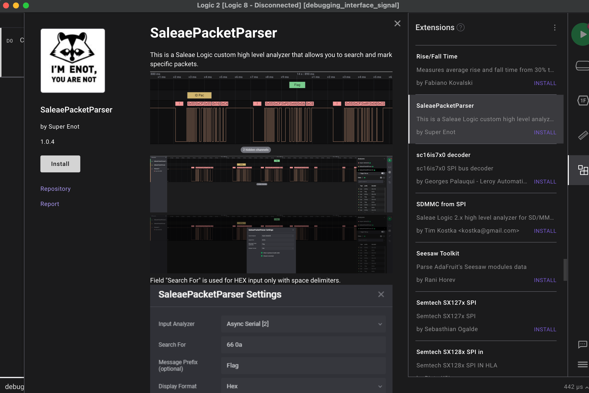
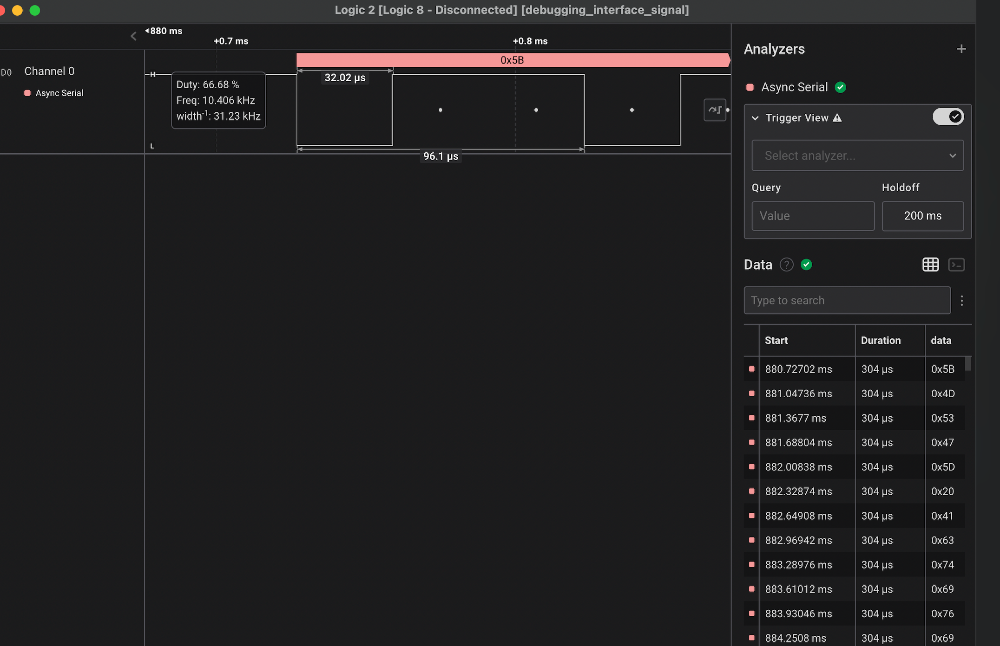

# Debugging interface

## The challenge:

Check the file:
`file debugging_interface_signal.sal`
```s
debugging_interface_signal.sal: Zip archive data, at least v2.0 to extract, compression method=deflate
```

Interesting. I don't know what is `.sal` file. But if it's zip then we use Unzip to decompress it:
`unzip debugging_interface_signal.sal`

We then get 2 more files:
```
-rw-r--r--@ 1 xxx staff   9.5K Apr  8  2021 debugging_interface_signal.sal
-rw-r--r--@ 1 xxx staff    22K Mar 23  2021 digital-0.bin
-rw-r--r--@ 1 xxx staff    27K Mar 23  2021 meta.json
```

Let see what inside meta:
`cat meta.json| jq > meta_new.json`

```json
{
  "version": 12,
  "data": {
    "renderViewState": {
      "leftEdgeTimeSec": 2.220446049250313e-16,
      "timeSecPerPixel": 0.001978117224489796,
      "analogChannelViewStates": [
        {
          "index": 0,
          "type": "Analog",
          "stripchart": {
            "viewportCenterValue": 2.5,
            "scalePerPixel": 0.0625
          }
        },

  ...
  <Thousands of line here>
  ...
  },
  "binData": [
    {
      "type": "Digital",
      "index": 0,
      "file": "./digital-0.bin"
    }
  ]
}

```

I have no idea what is this now.

Take a look at bin file: `file digital-0.bin`
```s
digital-0.bin: data
```

`xxd digital-0.bin`
```
00000000: 3c53 414c 4541 453e 0100 0000 6400 0000  <SALEAE>....d...
00000010: 0100 0000 0084 d787 414b 80f6 5e78 0100  ........AK..^x..
00000020: 0066 6666 6666 66e6 3f00 003a 0000 0000  .ffffff.?..:....
00000030: 0000 0000 0000 0000 0000 0000 8019 0000  ................
```

OK. I know this company. It's SALEAE, it sells many digital analyzer products. I actually bought a Saleae Logic 8 from them.
So this is probably a digital/analog log/data file from their software. Then we just need to install the software and look at it.



Then we install the Saleae Package Parser.

Here we are:



It's a single line digital signal -> Properly UART! 
Then we see the cycle time = 32.02 us
1/32.02us =31230 
Let choose 31250 baudrate for UART setting (use default)

Then we have the table. Use it feature we get the terminal log:
```s
\xBD\x847\x9C\xF9oH\xEE\x044C!Y \xF9\xA4~(\xB6  \x84IC\xE6\xA4\xDDY\xAD\xB4\xA0o\xC0> \x07
\x10\xDD\x86C\xBF`\xD9\x90
\xF64\xF9\xA4\x01\xBE\x14\xF9Y\xAD\xB4\xA0o\xC0>\xA4\x03C \xA4
o \xD9A\x01g $C\x88+B\xA4\x16\xC94      >\x1C\x96\xEDJ\xBF\xB4\0~\x10\xDDB\x08\xAE \x02If\x14\x08\xB4\x0B\xB7LO\x847\x9C\xF9o@0\xD9\x10\xEFd\x08B\x10\x0B\x866\x04&\0\xB6\x84+\x90      \xE9\xB0 \xE6\xF1\xC0>\xA4\x03C \xA4
o \xD9A\x01g $C\x88+B\xA4\x16\xC94      >\x1C\x96\xEDK\xF7 4\xB6\x84\x82\xB7\x94\x08\xEF04B\x84@\xB6\x84J\xD1|\xA1i\xA0\xEE]\x01\xAF\x84\x02\xF602\xB6\x04\xDD\xE6$\x08\xB7\x81\xDD4@\xAE`n4    >\x1C\x96\xED/\x80\xD9\xA4\xB64J4\xF7 \x92\x080\xFD4\xF75\x02\xBELO\x847\x9C\xF9o@\x90KB%\x04K\xB0\x04Kg\xA4\x14K\xB6 \xF9\x0B\xB74\x90Y \xE6\xF1\xC0>\x04C\xAF \xF9\x18?\x8C\xDDK"\x035\x01@6\x94
\x846\xFDk      >\x1C\x96\xEDB4\xD9\xB2I\xF7426\xA8\xDD C0\x03\x04\x08\xAE\xA4\x14\xC94 >\x1C\x96\xEDB4\xD9\xB2I\xF7426\xA8\xDD C0\x03\x04\x08\xAE\xA4\x14\xC94>\x1C\x96m\xECD\xD9\xD8\xEE\x80\xB2\x0B]N\x13u!\xF96\xBF\xE5\x03\xE7\x84\xD9    M7\xE9\x19\xE9(/\xC0\x01\x19!\xC91\xC9!\xC9\x01\xE6\x11\xF9\xE9\xD1\x06\xD6\x19 69\xD69\xC6\xC6\x166\xC6\x16&)\x06\xC6\xF6\x066\xC966\x11\xF6\xD61\xD6\x01\x06\x16)66\x19\xC16\xC6&\xF6\x16\xD6  \xE6\xC66\xC6\x11\x11   \xC9\x16\xC6\x16\x01\xD69\xE6\x19\xD6   !6\xD6\x10\xC1\xD7''9\xE9       \x16\x19!\xC91\xC9!\xC9\x01\xE6\x11\xF9\xE9\xD1\x06\x06\x066&\xC9\xC66\xC6\x16!\xD6\xE6\x01\xD6)\x19!\x11\xC6\x19\xD6&\x19\x199\x06\x16&\x16\x16  \x19\xD6!\x19\x19\xE66\xE6\xC1\x06&\x16))\x16\x11!!     \xE6\x166!\xE6!&\x166   !\x16\x169\xD6\x10\xC1\xD7''9\xE9       \x16\x19!\xC91\xC9!\xC9\x01\xE6\x11\xF9\xE9\xD1\x06\xE6\xD6\xD6\x19\x19\x16&6&\xD6\xE6!6\xE6!\x06\x16\x06\xF6\xC61\x19\x11      1\xD6\x166      \x11\x11\xC6    \x161\x111\xC61)\xC6\xD6\xF6\x06\x06\xE6\xD6\xE6        \xC6\xC1&\x11  \xC1\x16\x06\x06\x16\xC6\x19\xD61\x11\xD6\x10\xC1\xD7''9\xE9     \x16\x19!\xC91\xC9!\xC9\x01\xE6\x11\xF9\xE9\xD1\x06&&6\xD616\xC66)\x11\x066&      \x1169\xC6!\xD69\x166\x16\x16\x11\xC6   1!1\x01\xC6!\xD6&6\x06\x166     \x16    \xD6\x11\x16\x11\x06\xE6\x19\x11\xE6    )\x01\xD6\xF6\xC61!\x06\x06\xD6\x10\xC1\xD7''9\xE9      \x16\x19!\xC91\xC9!\xC9\x01\xE6\x11\xF9\xE9\xD1\x06\xC66\x16\xC6)\x16\x1661\xD6)!\x19&1\xD69\x166&\x19\x16\xE6\xC69&116)\x11\xD6\x19&))\x16\x16 9\x06\xF6\xE6\x06\x06&1\xE6     \xC6\xD6\x16\x16\xE6\x11\x19\xC9\xC6    )\xC9\xD6\x19&\xD6\x10\xC1\xD7''9\xE9   \x16\x19!\xC91\xC9!\xC9\x01\xE6\x11\xF9\xE9\xD1\x06\xE6\xD6\xD6\x19\x19\x16&6&\xD6\xE6!6\xE6!\x06\x16\x06\xF6\xC61\x19\x11      1\xD6\x166    \x11\x11\xC6    \x161\x111\xC61)\xC6\xD6\xF6\x06\x06\xE6\xD6\xE6       \xC6\xC1&\x11    \xC1\x16\x06\x06\x16\xC6\x19\xD61\x11\xD6\x10\xC1\xD7''9\xE9   \x16\x19!\xC91\xC9!\xC9\x01\xE6\x11\xF9\xE9\xD1\x06\xE6\xD6\xD6\x19\x19\x16&6&\xD6\xE6!6\xE6!\x06\x16\x06\xF6\xC61\x19\x11       1\xD6\x166      \x11\x11\xC6   \x161\x111\xC61)\xC6\xD6\xF6\x06\x06\xE6\xD6\xE6 \xC6\xC1&\x11   \xC1\x16\x06\x06\x16\xC6\x19\xD61\x11\xD6\x10\xC1\xD7''9\xE9    \x16\x19!\xC91\xC9!\xC9\x01\xE6\x11\xF9\xE9\xD1\x06\xD6\x11\x11\x11&)\xC6       \xC61\x11\x11\x11\xC1\x16\xF6\xC6\xE6)\xE6\x11  \xE6!   \xD6&6\x06\xD6\xC6\x06\x16)     9\xF6\xF6\xF6&\xC6\x19\x161\xD6\xC6\x06&\xC6)1\x19\xC6\xC9\xF6\x06\xE616      1       \xD6&\xD6\x10\xC1\xD7''9\xE9    \x16\x19!\xC91\xC9!\xC9\x01\xE6\x11\xF9\xE9\xD1\x06\xE69\xE6   \x11!&)\x16\x16\xF6\xD6\xC6\x16  \x16\x06&)\x19&6\x111\x06\xF6\xE6\x11\xD6\xF6\xE6!6\xE6\xE6     \x19\xE6\x19&\xD6\xC69\x16\xD6!1!\x16&1\x16\xF6\x166)66\x066!9\xD6\x16\xE9\x167\xE9\x19\xE9(/\xC0\x01\x19!\xC91\xC9!\xC9\x01\xE6\x11\xF9\xE9\xD1\x06\xC6\xF6\xE6&!\x19  1       \xE6\xE66\x06\xD66\xF6\x16\xE6!\x166)\xC6&     9\xC6\xC6\x11\xF6\xD661!1        )69\x066\x11\xD6\xD6\xD6    !\xD66\xE66\xD6\x19\xF6\x16\xD66\x11\x19        \x16\x16))\xD6\x10\xC1\xD7''9\xE9       \x16\x19!\xC91\xC9!\xC9\x01\xE6\x11\xF9\xE9\xD1\x06\xE66\xE6\x06\x16\xE6        \x196\x016\xC6\xD6\x166!\x16\xE6\xC9\xE6\x19\x11\x16\x11\xC9&)!6&)      9\xE6\x01\xE6\x16\x06\xE6\x166  6!\xF6&\xE61\x16!\x16\xD6\x19\xD61\x19\x169\xE6\x16\xC6))\x06\xD6\x10\xC1\xD7''9\xE9    \x16\x19!\xC91\xC9!\xC9\x01\xE6\x11\xF9\xE9\xD1\x066\xE6&\xD6\xF6\x16   \x16\x166\xC6&9\x166)   9\xD66\xC6      \x19\xC61\xC9&)\xC1\x16)\xC16   !\x16\xD6)\xC1\xC66&9&& 6)\xC6\xE6\x06\xE6\xC1\xE6)\xC6 \x11\xC1\x169\x16!\x01\xD6\x10\xC1\xD7''9\xE9   \x16\x19!\xC91\xC9!\xC9\x01\xE6\x11\xF9\xE9\xD1\x066\xE6&\xD6\xF6\x16   \x16\x166\xC6&9\x166)   9\xD66\xC6      \x19\xC61\xC9&)\xC1\x16)\xC16   !\x16\xD6)\xC1\xC66&9&& 6)\xC6\xE6\x06\xE6\xC1\xE6)\xC6 \x11\xC1\x169\x16!\x01\xD6\x10\xC1\xD7''9\xE9   \x16\x19!\xC91\xC9!\xC9\x01\xE6\x11\xF9\xE9\xD1\x06\x06\x16)\xD0\xDF.\xCE\xD6\xC9\x16\x16\xE6\xD7\xF6)\xE6\xD7'\xCE\xCE.'\xD8\xCE\x19?\x19!\xE6\xD7     6\xF6\xC9.\xD6\xF1!\xF9)\xE6\xD7        '\x18\xD9\x01\xD6\xF6\xF6\xE9\xE6\x19&\x16\xF9\xE9\xD6\x176\xC6!\x19\xC6\xF9    .\xCE/\x18\xC7\x19\x16\x16\xD6&\xD6\xE9\x167\xE9\x19\xE9(/\xC0\x01\x19!\xC91\xC9!\xC9\x01\xE6\x11\xF9\xE9\xD1\x06\xD6\x19       69\xD69\xC6\xC6\x166\xC6\x16&)\x06\xC6\xF6\x066\xC966\x11\xF6\xD6       1\xD6\x01\x06\x16)66\x19\xC16\xC6&\xF6\x16\xD6 \xE6\xC66\xC6\x11\x11    \xC9\x16\xC6\x16\x01\xD69\xE6\x19\xD6   !6\xD6\x10\xC1\xD7''9\xE9      \x16\x19!\xC91\xC9!\xC9\x01\xE6\x11\xF9\xE9\xD1\x06\x06\x066&\xC9\xC66\xC6\x16!\xD6\xE6\x01\xD6)\x19!\x11\xC6\x19\xD6&\x19\x199\x06\x16&\x16\x16\x19\xD6!\x19\x19\xE66\xE6\xC1\x06&\x16))\x16\x11!!     \xE6\x166!\xE6!&\x166  !\x16\x169\xD6\x10\xC1\xD7''9\xE9        \x16\x19!\xC91\xC9!\xC9\x01\xE6\x11\xF9\xE9\xD1\x06\xE6\xD6\xD6\x19\x19\x16&6&\xD6\xE6!6\xE6!\x06\x16\x06\xF6\xC61\x19\x11      1\xD6\x166      \x11\x11\xC6    \x161\x111\xC61)\xC6\xD6\xF6\x06\x06\xE6\xD6\xE6        \xC6\xC1&\x11   \xC1\x16\x06\x06\x16\xC6\x19\xD61\x11\xD6\x10\xC1\xD7''9\xE9    \x16\x19!\xC91\xC9!\xC9\x01\xE6\x11\xF9\xE9\xD1\x06&&6\xD616\xC66)      \x11\x066&      \x1169\xC6!\xD69\x166\x16\x16\x11\xC6   1!1\x01\xC6!\xD6&6\x06\x166     \x16    \xD6\x11        \x16\x11\x06\xE6\x19\x11\xE6    )\x01\xD6\xF6\xC61!\x06\x06\xD6\x10\xC1\xD7''9\xE9      \x16\x19!\xC91\xC9!\xC9\x01\xE6\x11\xF9\xE9\xD1\x06\xC66\x16\xC6)\x16\x1661\xD6)!\x19&1\xD69\x166&\x19\x16\xE6\xC69&116)\x11\xD6\x19&))\x16\x16 9\x06\xF6\xE6\x06\x06&1\xE6     \xC6\xD6\x16\x16\xE6\x11\x19\xC9\xC6    )\xC9\xD6\x19&\xD6\x10\xC1\xD7''9\xE9   \x16\x19!\xC91\xC9!\xC9\x01\xE6\x11\xF9\xE9\xD1\x06\xE6\xD6\xD6\x19\x19\x16&6&\xD6\xE6!6\xE6!\x06\x16\x06\xF6\xC61\x19\x11      1\xD6\x166      \x11\x11\xC6    \x161\x111\xC61)\xC6\xD6\xF6\x06\x06\xE6\xD6\xE6        \xC6\xC1&\x11   \xC1\x16\x06\x06\x16\xC6\x19\xD61\x11\xD6\x10\xC1\xD7''9\xE9    \x16\x19!\xC91\xC9!\xC9\x01\xE6\x11\xF9\xE9\xD1\x06\xE6\xD6\xD6\x19\x19\x16&6&\xD6\xE6!6\xE6!\x06\x16\x06\xF6\xC61\x19\x11      1\xD6\x166      \x11\x11\xC6    \x161\x111\xC61)\xC6\xD6\xF6\x06\x06\xE6\xD6\xE6        \xC6\xC1&\x11   \xC1\x16\x06\x06\x16\xC6\x19\xD61\x11\xD6\x10\xC1\xD7''9\xE9    \x16\x19!\xC91\xC9!\xC9\x01\xE6\x11\xF9\xE9\xD1\x06\xD6\x11\x11\x11&)\xC6  \xC61\x11\x11\x11\xC1\x16\xF6\xC6\xE6)\xE6\x11  \xE6!   \xD6&6\x06\xD6\xC6\x06\x16)     9\xF6\xF6\xF6&\xC6\x19\x161\xD6\xC6\x06&\xC6)1\x19\xC6\xC9\xF6\x06\xE616        1       \xD6&\xD6\x10\xC1\xD7''9\xE9    \x16\x19!\xC91\xC9!\xC9\x01\xE6\x11\xF9\xE9\xD1\x06\xE69\xE6    \x11!&)\x16\x16\xF6\xD6\xC6\x16\x16\x06&)\x19&6\x111\x06\xF6\xE6\x11\xD6\xF6\xE6!6\xE6\xE6      \x19\xE6\x19&\xD6\xC69\x16\xD6!1!\x16&1\x16\xF6\x166)66\x066!9\xD6\x16\xE9\x167\xE9\x19\xE9(/\xC0\x01\x19!\xC91\xC9!\xC9\x01\xE6\x11\xF9\xE9\xD1\x06\xC6\xF6\xE6&!\x19  1      \xE6\xE66\x06\xD66\xF6\x16\xE6!\x166)\xC6&      9\xC6\xC6\x11\xF6\xD661!1      )69\x066\x11\xD6\xD6\xD6 !\xD66\xE66\xD6\x19\xF6\x16\xD66\x11\x19        \x16\x16))\xD6\x10\xC1\xD7''9\xE9       \x16\x19!\xC91\xC9!\xC9\x01\xE6\x11\xF9\xE9\xD1\x06\xE66\xE6\x06\x16\xE6        \x196\x016\xC6\xD6\x166!\x16\xE6\xC9\xE6\x19\x11\x16\x11\xC9&)!6&)      9\xE6\x01\xE6\x16\x06\xE6\x166  6!\xF6&\xE61\x16!\x16\xD6\x19\xD61\x19\x169\xE6\x16\xC6))\x06\xD6\x10\xC1\xD7''9\xE9    \x16\x19!\xC91\xC9!\xC9\x01\xE6\x11\xF9\xE9\xD1\x066\xE6&\xD6\xF6\x16   \x16\x166\xC6&9\x166)  9\xD66\xC6       \x19\xC61\xC9&)\xC1\x16)\xC16   !\x16\xD6)\xC1\xC66&9&& 6)\xC6\xE6\x06\xE6\xC1\xE6)\xC6 \x11\xC1\x169\x16!\x01\xD6\x10\xC1\xD7''9\xE9   \x16\x19!\xC91\xC9!\xC9\x01\xE6\x11\xF9\xE9\xD1\x066\xE6&\xD6\xF6\x16   \x16\x166\xC6&9\x166)   9\xD66\xC6      \x19\xC61\xC9&)\xC1\x16)\xC16   !\x16\xD6)\xC1\xC66&9&&6)\xC6\xE6\x06\xE6\xC1\xE6)\xC6  \x11\xC1\x169\x16!\x01\xD6\x10\xC1\xD7''9\xE9  \x16\x19!\xC91\xC9!\xC9\x01\xE6\x11\xF9\xE9\xD1\x06\x06\x16)\xD0\xDF.\xCE\xD6\xC9\x16\x16\xE6\xD7\xF6)\xE6\xD7'\xCE\xCE.'\xD8\xCE\x19?\x19!\xE6\xD7      6\xF6\xC9.\xD6\xF1!\xF9)\xE6\xD7        '\x18\xD9\x01\xD6\xF6\xF6\xE9\xE6\x19&\x16\xF9\xE9\xD6\x176\xC6!\x19\xC6\xF9    .\xCE/\x18\xC7\x19\x16\x16\xD6&\xD6\xE9\x16[MSG] Activity from: ec1c7e7449341b58478c93c27ea6e08a53cc834279e1643dbba994a0e7f3ea43
[MSG] Activity from: 003b9434a45f0eecd2d35bcc78129aa3edc363f802ae5abdd161c4f421ca49a7
[MSG] Activity from: 65ec312325f43f40107dfcba651cab2d1afb6df54578065f1d8bba89801d3ef2
[MSG] Activity from: 223e634cea203ba2c7d4e7931a2dafdf0d452309c1a1eb1a28fc2fae057df400
[MSG] Activity from: 431d591c6eed3b6e793b316d7bf6ce2e3be51aa707680b6f14511fbc9dae9e32
[MSG] Activity from: 65ec312325f43f40107dfcba651cab2d1afb6df54578065f1d8bba89801d3ef2
[MSG] Activity from: 65ec312325f43f40107dfcba651cab2d1afb6df54578065f1d8bba89801d3ef2
[MSG] Activity from: ebb2b5d1dfbbb8174f5fb1fd15230540aea77772d3a65482def3d978f6caf152
[MSG] Activity from: f7fab4b591754a190be32cb607f257f436fa3f325d71edf41b6179c5330cd75a
[MSG] Activity from: 476bdcaf166385371f49c54ba74d275cfdfa5c70c255ea45363e3795cbc11ae5
[MSG] Activity from: 63681fa3c03451c49f9fc2ab9be43bea7f069069c1c472f6a41e3ef3a761de50
[MSG] Activity from: 36257a19934b71cea753da3df9be8ae8ca49ee843b72b1c5468f8f5dab8a7ad0
[MSG] Activity from: 36257a19934b71cea753da3df9be8ae8ca49ee843b72b1c5468f8f5dab8a7ad0
[MSG] Activity from: HTB{d38u991n9_1n732f4c35_c4n_83_f0und_1n_41m057_3v32y_3m83dd3d_d3v1c3!!52}
```

Ahaha!
The flag: `HTB{d38u991n9_1n732f4c35_c4n_83_f0und_1n_41m057_3v32y_3m83dd3d_d3v1c3!!52}`
