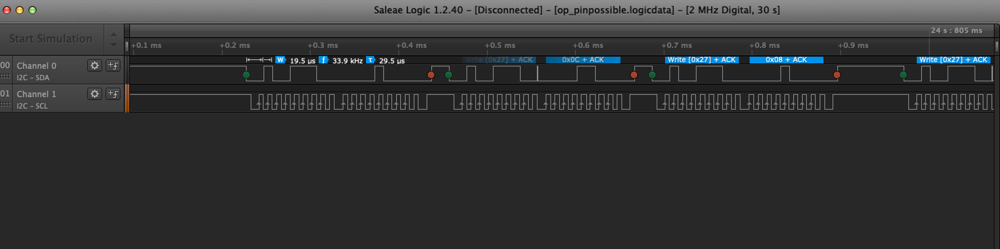
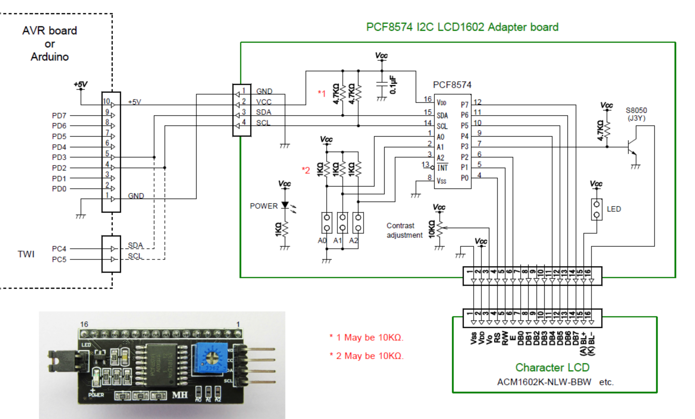
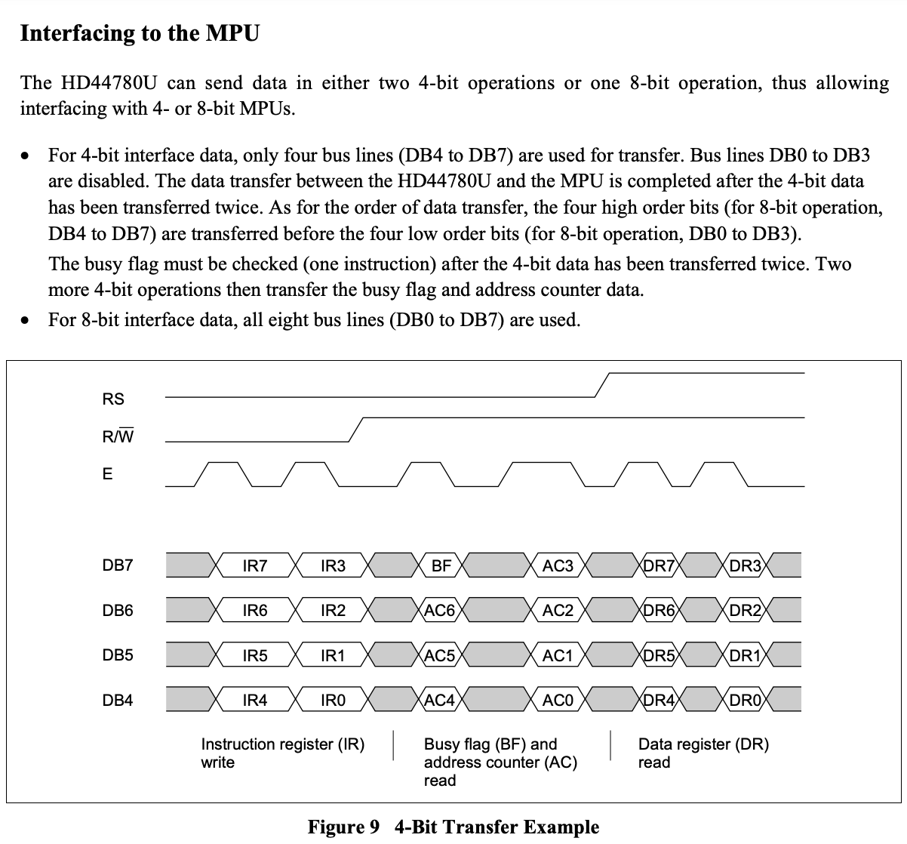
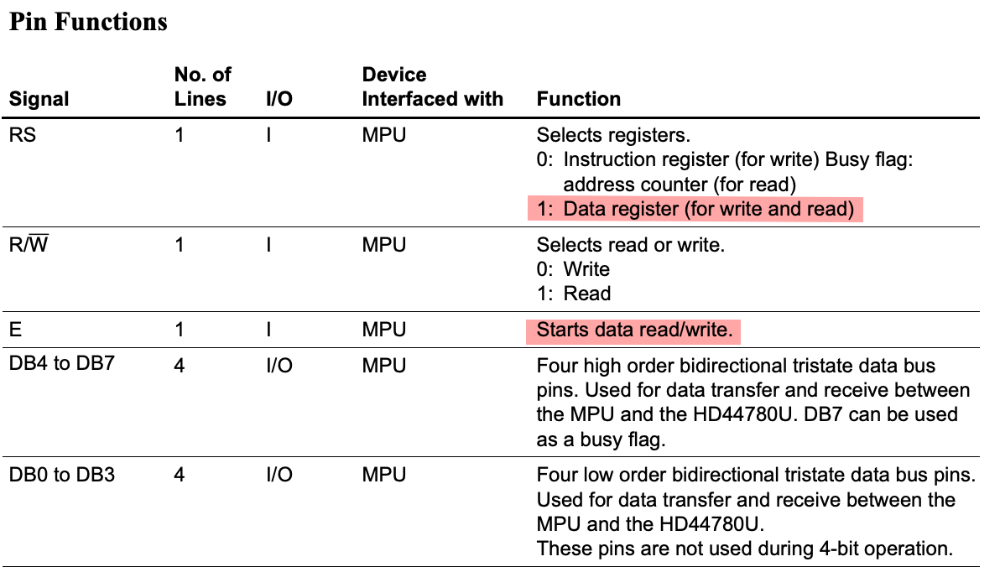

# Mission pinpossible

## CHALLENGE DESCRIPTION


## Walkthrough

We got 2 files:
```
2.0M Jul 10  2020 op_pinpossible.logicdata
1.7M Jul  8  2020 security_keypad.jpeg
```

`op_pinpossible.logicdata: CLIPPER COFF executable C1 R1 not stripped - version 30 -Ctnc -Cdnc` -> saleae.com Logic legacy software

We need to download the software to decode the data




There are 2 lines and 1 repeat pattern =>  it's I2C protocol
Choose SCA for channel 0 and SCL for channel 1

=> Export data to data.txt file
```s
Time [s],Packet ID,Address,Data,Read/Write,ACK/NAK
0.448499000000000,0,0x27,0x08,Write,ACK
0.448728500000000,1,0x27,0x0C,Write,ACK
0.448958500000000,2,0x27,0x08,Write,ACK
0.449248000000000,3,0x27,0x18,Write,ACK
0.449478000000000,4,0x27,0x1C,Write,ACK
0.449707500000000,5,0x27,0x18,Write,ACK
0.452084500000000,6,0x27,0x88,Write,ACK
0.452314500000000,7,0x27,0x8C,Write,ACK
0.452544000000000,8,0x27,0x88,Write,ACK
```

Then we can extract the Data column: `cat data.txt | cut -d ',' -f4 > content.txt`

```s
Data
0x08
0x0C
0x08
0x18
0x1C
0x18
...
```

From the picture, we can see the LCD is connected to a PCF8574 I2C adapter.
So the keypad write some values to LCD to the address 0x27. 
Then we need to know what kind of LCD.

> PCF8574 chip from Texas Instruments, its I2C address is 0x27

Found a link Arduno LCD control by PCF8574: https://lastminuteengineers.com/i2c-lcd-arduino-tutorial/
PCF8574 datasheet: https://www.ti.com/lit/ds/symlink/pcf8574a.pdf
Datasheet LCD: https://components101.com/sites/default/files/component_datasheet/16x2%20LCD%20Datasheet.pdf
Datasheet of LCD controller: https://www.sparkfun.com/datasheets/LCD/HD44780.pdf

Check the Arduino library lib: https://github.com/johnrickman/LiquidCrystal_I2C/blob/master/LiquidCrystal_I2C.cpp
I2C LCD adapter schematic: https://avrhelp.mcselec.com/index.html?lcd_i2c_pcf8574.htm


```cpp
void LiquidCrystal_I2C::init_priv()
{
	Wire.begin();
	_displayfunction = LCD_4BITMODE | LCD_1LINE | LCD_5x8DOTS; // --> 0x00
	begin(_cols, _rows);  
}
```

So it uses 4 bit mode.

Some important flag:
```c
// flags for function set
#define LCD_8BITMODE 0x10
#define LCD_4BITMODE 0x00
#define LCD_2LINE 0x08
#define LCD_1LINE 0x00
#define LCD_5x10DOTS 0x04
#define LCD_5x8DOTS 0x00

// flags for backlight control
#define LCD_BACKLIGHT 0x08
#define LCD_NOBACKLIGHT 0x00

#define En B00000100  // Enable bit
#define Rw B00000010  // Read/Write bit
#define Rs B00000001  // Register select bit
```

```cpp
void LiquidCrystal_I2C::expanderWrite(uint8_t _data){                                        
	Wire.beginTransmission(_Addr);
	printIIC((int)(_data) | _backlightval);
	Wire.endTransmission();   
}
```

```cpp
void LiquidCrystal_I2C::send(uint8_t value, uint8_t mode) {
	uint8_t highnib=value&0xf0;
	uint8_t lownib=(value<<4)&0xf0;
       write4bits((highnib)|mode);
	write4bits((lownib)|mode); 
}
```



```s
PCF8574       HD44780
  P7   <--->   DB7
  P6   <--->   DB6
  P5   <--->   DB5
  P4   <--->   DB4
  P3   <--->   K (BL-)
  P2   <--->   E
  P1   <--->   R/W
  P0   <--->   RS
```



There are 3 types of instructions: IR, BF+AC, and DR

For 4-bit mode, it sends 2 times on the DB7-DB4 bus to present 1 byte.



If we only care about Data register, we will pick only E=1 and RS=1
Meaning Data & 0x05 = True

So we will filter some data like: 0x2D
before filter:
```s
0.453817500000000,13,0x27,0x2D,Write,ACK
0.454047000000000,14,0x27,0x29,Write,ACK
0.454337000000000,15,0x27,0x09,Write,ACK
0.454566500000000,16,0x27,0x0D,Write,ACK
0.454796000000000,17,0x27,0x09,Write,ACK
0.455081000000000,18,0x27,0x49,Write,ACK
0.455316000000000,19,0x27,0x4D,Write,ACK
0.455545500000000,20,0x27,0x49,Write,ACK
0.455830500000000,21,0x27,0x59,Write,ACK
0.456060000000000,22,0x27,0x5D,Write,ACK
0.456289500000000,23,0x27,0x59,Write,ACK
0.456574500000000,24,0x27,0x69,Write,ACK
0.456804000000000,25,0x27,0x6D,Write,ACK
0.457034000000000,26,0x27,0x69,Write,ACK
0.457313500000000,27,0x27,0xE9,Write,ACK
0.457543000000000,28,0x27,0xED,Write,ACK
```
after filter:
```s
0.453817500000000,13,0x27,0x2D,Write,ACK
0.454566500000000,16,0x27,0x0D,Write,ACK
0.455316000000000,19,0x27,0x4D,Write,ACK
0.456060000000000,22,0x27,0x5D,Write,ACK
0.456804000000000,25,0x27,0x6D,Write,ACK
0.457543000000000,28,0x27,0xED,Write,ACK
```
then combine 2 line them into 1 byte:
```s
0x20,0x45,0x6E -> " En"
```

Great! Look like we got " En" in the " Enter Password" string from the picture

Look like the format if `0x*D` . 

```s
cat content.txt| grep "0x\dD" > filterdata.txt
```

Let write python script to filter them.
```python
filename = "filterdata.txt"
with open(filename) as file:
    lines = [line.rstrip() for line in file]
    hex = ""
    for i in range(0,len(lines),2):
        try:
            hex +=lines[i][2]+lines[i+1][2]
            print(bytes.fromhex(lines[i][2]+lines[i+1][2]).decode("ascii"), end="")
        except:
            i+1
            print("\n\n===Error: ===", i)
            pass
```

Output:
```s
Enter PasswordH Enter Password*T Enter Password**B Enter Password***{ Enter Password****8 Enter Password*****4 Enter Password******d Enter Password*******_ Enter Password********d Enter Password*********3 Enter Password**********5 Enter Password***********1 Enter Password************9 Enter Password*************n Enter Password**************_ Enter Password***************c Enter Password****************4 Enter Password*****************n Enter Password******************_ Enter Password*******************1 Enter Password********************3 Enter Password*********************4 Enter Password**********************d Enter Password***********************_ Enter Password************************7 Enter Password*************************0 Enter Password**************************_ Enter Password***************************1 Enter Password****************************3 Enter Password*****************************4 Enter Password******************************k Enter Password*******************************5 Enter Password********************************! Enter Password*********************************d Enter Password**********************************@ Enter Password***********************************}

===Error: === 2412
 Enter Password************************************  ACCESS GRANDED SYSTEM

===Error: === 2564
 DISARM

===Error: === 2580
```

We nearly got there. I see `H-T-B-{` pattern :D
So why it's splitted by "Enter Password"? -> It's because the device needs to send the string continuously to keep it pop up to the LCD.

Remove all the "Enter Password", " ", and "*".
We got the flag: `HTB{84d_d3519n_c4n_134d_70_134k5!d@}`

