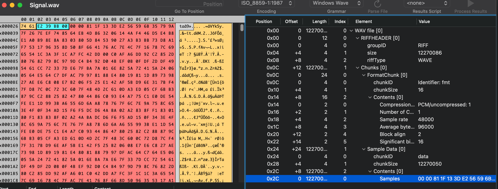
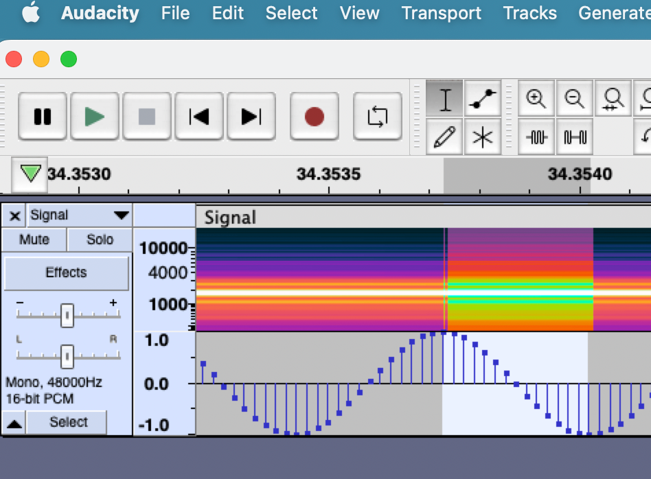

# Factory

## CHALLENGE DESCRIPTION
Some amateur radio hackers captured a strange signal from space. A first analysis indicates similarities with signals transmitted by the ISS. Can you decode the signal and get the information?

## Walkthrough
First I analysis the Wav file using Synalyze It

Sample rate 48000
Single channel, single chunk data

Use Audacity to check. Look like it has Sine signal inside. 
Zoom in we have 14 samples -> The sine frequency = 3428 Hz

I can hear notch sound every 500ms, check again with the waveform (matched)