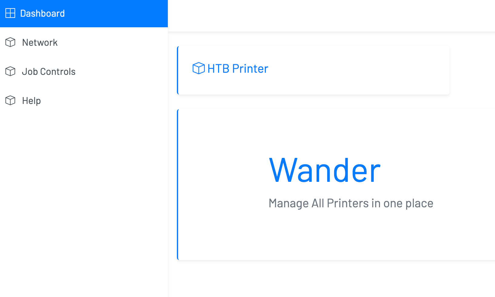

# Wander

## CHALLENGE DESCRIPTION
My uncle isn't allowing me to print documents. He's off to vacation and I need a PIN to unlock this printer. All I found is a web server where this printer is managed from. Can you help me with this situation ?


## Walkthrough
First let scan the target port
```s
nmap -sV -sC -Pn 139.59.181.223 -p 30623
Starting Nmap 7.93 ( https://nmap.org ) at 2023-04-15 11:41 +07
Nmap scan report for 139.59.181.223
Host is up (0.17s latency).

PORT      STATE SERVICE VERSION
30623/tcp open  http    Werkzeug httpd 2.0.1 (Python 3.7.11)
|_http-server-header: Werkzeug/2.0.1 Python/3.7.11
|_http-title: Wander Dashboard
```

They have HTTP server at 139.59.181.223:30623
We can use web browser to access it


Scan all html paths: `gobuster dir -u http://139.59.181.223:30623/ -w common.txt`
```s
===============================================================
Gobuster v3.5
by OJ Reeves (@TheColonial) & Christian Mehlmauer (@firefart)
===============================================================
[+] Url:                     http://139.59.181.223:30623/
[+] Method:                  GET
[+] Threads:                 10
[+] Wordlist:                common.txt
[+] Negative Status codes:   404
[+] User Agent:              gobuster/3.5
[+] Timeout:                 10s
===============================================================
2023/04/15 11:45:08 Starting gobuster in directory enumeration mode
===============================================================
/jobs                 (Status: 200) [Size: 5481]
/printer              (Status: 405) [Size: 178]
Progress: 1942 / 1943 (99.95%)
===============================================================
2023/04/15 11:46:19 Finished
===============================================================
```

In http://139.59.181.223:30623/jobs : `@PJL INFO ID`


Send POST request: 
`curl POST http://139.59.181.223:30623/printer -d 'pjl=value1' -v`

Not sure why this empty and any use for us: `https://cpwebassets.codepen.io/assets/common/stopExecutionOnTimeout-157cd5b220a5c80d4ff8e0e70ac069bffd87a61252088146915e8726e5d9f147.js`

